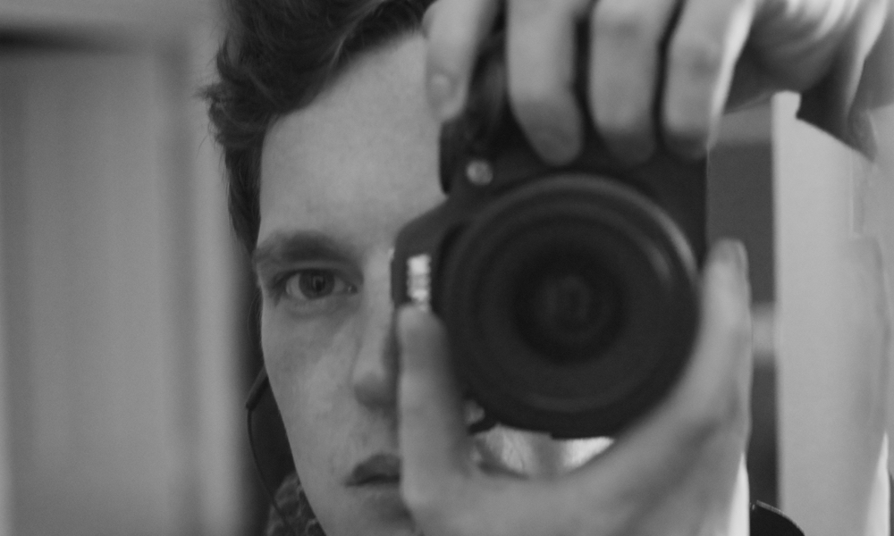

My research interests are mainly focused on decision-making and energy balance (effort production & food intake), and more generally computational psychiatry and dynamical neurosciences.

For a quick illustrated introduction to my research, check my <a href="http://histoires-courtes.fr/#page=Rigoux" target="_blank">"short story"</a>. And please have a look at the <a href="http://histoires-courtes.fr" target="_blank">wonderful work</a> of Jean-François Dars and Anne Papillault for more portraits!

{:class="img-responsive"}

<h2>Quick resume</h2>

- **2014-now** Postdoc at the _Max-Planck Institute for Metabolism Research_ in Cologne in the _Translational Neuro-Circuitry_ groug (Marc Tittgemeyer). I am also a member of the _Translational Neuroscience Unit_ in Zürich (Klass E. Stephan).
- **2012-14** Postodc at the _Brain and Spine Insitute_ in Paris, in the _Motivation, Brain and Behaviour_ team (Jean Daunizeau, Mathias Pessiglione & Sebastien Bouret).
- **2008-11** Ph.D in Cognitive Neurosciences with Emmanuel Guigon at the _Institute for Intelligent Systems and Robotics_ (Paris).
